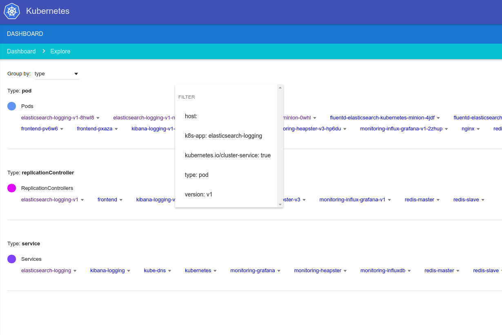

# Kubernetes UI
`译者：李昂` `校对：无`


Kubernetes有一个基于web的用户界面，它可以图表化显示当前集群状态。

## 访问UI

Kubernetes界面默认是作为集群插件部署的。要访问它需要进入`https://<kubernetes-master>/ui`这个地址，之后会重定向到`https://<kubernetes-master>/api/v1/proxy/namespaces/kube-system/services/kube-ui/#/dashboard/`。

如果你发现你无法访问UI，那有可能是Kubernetes UI服务在你的集群上还没有启动。如果是这样，你可以手动开启UI服务：
```
kubectl create -f cluster/addons/kube-ui/kube-ui-rc.yaml --namespace=kube-system
kubectl create -f cluster/addons/kube-ui/kube-ui-svc.yaml --namespace=kube-system

```
通常，这些应该通过`kube-addons.sh` 脚本自动地被运行在主节点上。

## 使用UI

Kubernetes UI可以被用于监控你当前的集群，例如查看资源利用率或者检查错误信息。但是你不能用UI修改集群。


### 节点资源使用

访问Kubernetes UI后，你可以看到主页动态列出的你当前集群的所有节点，而且还会有相关信息列出，包括内部IP地址，CPU状态，内存状态和文件系统状态。


### Dashboard视图

在页面的右上方点击“Views”按钮可以看到其他可用的视图，包括Explore，Pods，Nodes，Replication Controllers，Services和Events。

### Explore视图

Explore视图允许你轻松看到当前集群的pods，replication controller和services。

“Group by”下拉列表允许你用类型、名称、主机等条件对资源分组。

你也可以点击资源列表的下拉三角来生成一个过滤器，有多重过滤类型可供选择。

若是要看每项资源的更多细节，就在上面点击。


### 其他视图

其他视图（Pods, Nodes, Replication Controllers, Services, and Events）简单列出了每种资源的信息。你也可以点击其他种类获取更多细节。


## 更多信息


想了解更多信息，访问[Kubernetes UI development document](http://releases.k8s.io/v1.0.6/www/README.md) 在web目录。

