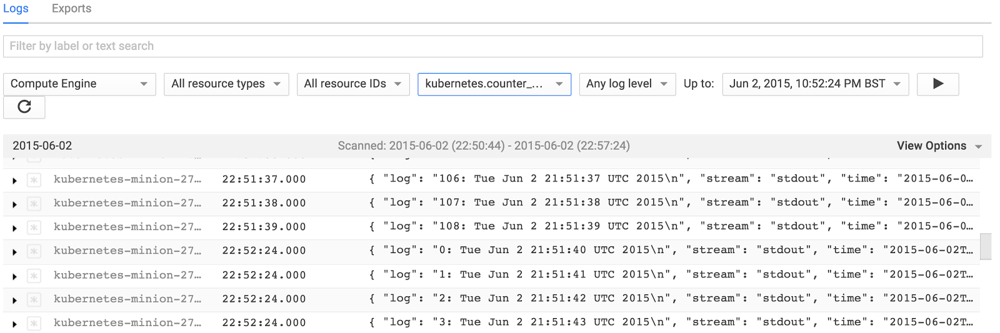

# 从集群级别日志到Google云日志平台
通常一个忙碌的Kubernetes集群运行着很多系统和应用级别的pods.那么系统管理员如何才能收集，管理和查看这些系统pods的日志呢?那么用户应该如何查询这些由pods组成的应用日志呢?这些pods可能会被重新启动或者是自动的被Kubernetes系统创建出来。这些问题可以通过Kubernetes集群日志服务来解决。

集群级别的日志服务能够让我们收集来自于运行在pod中的容器镜像或者是pod，甚至是整个集群的日志，这些日志持久性记录了超出他们运行生命周期的全部状态。这篇文章中，假设我们已经创建了Kubernetes集群，并且支持向谷歌云日志服务发送集群级别日志。集群一旦创建，你会拥有一个系统pods的集合，这些pods运行在`kube-system`命名空间中，它们支持收集监控、日志记录以及Kubernetes服务的域名名称解析信息。

```
$ kubectl get pods --namespace=kube-system
NAME                                           READY     REASON    RESTARTS   AGE
fluentd-cloud-logging-kubernetes-minion-0f64   1/1       Running   0          32m
fluentd-cloud-logging-kubernetes-minion-27gf   1/1       Running   0          32m
fluentd-cloud-logging-kubernetes-minion-pk22   1/1       Running   0          31m
fluentd-cloud-logging-kubernetes-minion-20ej   1/1       Running   0          31m
kube-dns-v3-pk22                               3/3       Running   0          32m
monitoring-heapster-v1-20ej                    0/1       Running   9          32m
```


图片显示GCE上创建了4个节点，紫色背景显示的是每个节点的虚拟节点名称。灰色方块中显示的分别是内网和外网IP地址，绿色方块显示的是运行在节点中的pods。每一个方框中显示了pod的名称，运行的命名空间，ip地址以及执行的镜像名称。我们可以看到每个节点都运行一个叫做fluentd-cloud-logging的pod,用来收集节点容器的运行日志并且发送到Google云日志服务。其中一个节点上运行着一个[集群域名解析](http://kubernetes.io/v1.0/docs/admin/dns.html)的pod,另外一个节点上运行中提供监控服务的pod。

为了帮助我们解释集群级别日志服务是如何工作的，让我们从一个合成日志产生器开始，这个pod的定义[counter-pod.yaml](http://kubernetes.io/v1.0/examples/blog-logging/counter-pod.yaml):

```json
apiVersion: v1
 kind: Pod
 metadata:
   name: counter
   namespace: default
 spec:
   containers:
   - name: count
     image: ubuntu:14.04
     args: [bash, -c, 
            'for ((i = 0; ; i++)); do echo "$i: $(date)"; sleep 1; done']
```

这个pod规范定义了一个容器，这个容器一旦创建就会运行一个bash脚本。这个脚本简单的输出一个计数器的值，每秒运行一次，无限运行下去。我们在默认的命名空间中创建这个pod。

```bash
$ kubectl create -f examples/blog-logging/counter-pod.yaml
 pods/counter
 ```
 
 我们可以查看这个运行的pod:
 ```bash
 $ kubectl get pods
NAME                                           READY     STATUS    RESTARTS   AGE
counter                                        1/1       Running   0          5m
 ```
 这一步可能需要几分钟来下载Ubuntu:14.04图像，pod的状态显示为`Pending`。
 
 计数器pod运行在其中一个节点上：
 


当pod状态变成`Running`后，我们可以用kubectl logs命令来查看计数器pod的输出。

```
$ kubectl logs counter
0: Tue Jun  2 21:37:31 UTC 2015
1: Tue Jun  2 21:37:32 UTC 2015
2: Tue Jun  2 21:37:33 UTC 2015
3: Tue Jun  2 21:37:34 UTC 2015
4: Tue Jun  2 21:37:35 UTC 2015
5: Tue Jun  2 21:37:36 UTC 2015
...
```
这条命令用于从一个运行在容器中镜像的Docker日志文件中读取文本日志。我们可以连到这个运行的容器，观察计数器bash脚本运行情况。
```
$ kubectl exec -i counter bash
ps aux
USER       PID %CPU %MEM    VSZ   RSS TTY      STAT START   TIME COMMAND
root         1  0.0  0.0  17976  2888 ?        Ss   00:02   0:00 bash -c for ((i = 0; ; i++)); do echo "$i: $(date)"; sleep 1; done
root       468  0.0  0.0  17968  2904 ?        Ss   00:05   0:00 bash
root       479  0.0  0.0   4348   812 ?        S    00:05   0:00 sleep 1
root       480  0.0  0.0  15572  2212 ?        R    00:05   0:00 ps aux
```
如果任何原因导致运行在pod中的镜像被杀掉了，然后又被Kubernetes重新启动，那么会发生什么呢？我们仍然可以看到，重新启动的容器日志会接着之前调用容器输出的日志行后面输出吗？或者是原来容器的执行日志会丢失，只能看到新容器的日志行输出吗？我们来看一看，首先停止当前正在运行的计数器。
```
$ kubectl stop pod counter
pods/counter
```
现在我们重启这个计数器。
```
$ kubectl create -f examples/blog-logging/counter-pod.yaml
pods/counter
```
等容器重新启动后重新获取日志。
```
$ kubectl logs counter
0: Tue Jun  2 21:51:40 UTC 2015
1: Tue Jun  2 21:51:41 UTC 2015
2: Tue Jun  2 21:51:42 UTC 2015
3: Tue Jun  2 21:51:43 UTC 2015
4: Tue Jun  2 21:51:44 UTC 2015
5: Tue Jun  2 21:51:45 UTC 2015
6: Tue Jun  2 21:51:46 UTC 2015
7: Tue Jun  2 21:51:47 UTC 2015
8: Tue Jun  2 21:51:48 UTC 2015
```
这个pod容器中的首次调用日志丢失了！理想情况是，我们会运行在每个pod中的每一个容器的每一次调用日志行。此外，即使pod重新启动，我们仍然希望保留所有的pod中容器发出的所有日志行。但是不用担心，这仅仅是Kubernetes提供的集群级别的日志功能。当集群创建后，每一个容器的标准输出和标准错误输出都可以被运行在每个节点中的[Fluentd](http://www.fluentd.org/)打到[Google云日志平台](https://cloud.google.com/logging/docs/)或者是打到Elasticsearch中用Kibana来查看。

当Kubernetes集群创建后开启了记录到Google云日志平台的功能，系统会在集群每个节点上创建一个叫做`fluentd-cloud-logging`的pod来收集Docker容器日志。在这篇博客一开始我们就可以看到如何获取这些pods的命令。

这个日志收集的pod规范文件，看起来像这样[fluentd-gcp.yaml](http://releases.k8s.io/v1.0.6/cluster/saltbase/salt/fluentd-gcp/fluentd-gcp.yaml):
``` json
apiVersion: v1
kind: Pod
metadata:
  name: fluentd-cloud-logging
  namespace: kube-system
spec:
  containers:
  - name: fluentd-cloud-logging
    image: gcr.io/google_containers/fluentd-gcp:1.11
    resources:
      limits:
        cpu: 100m
        memory: 200Mi
    env:
    - name: FLUENTD_ARGS
      value: -qq
    volumeMounts:
    - name: containers
      mountPath: /var/lib/docker/containers
  volumes:
  - name: containers
    hostPath:
      path: /var/lib/docker/containers
```
这个pod的规范将包含Docker日志文件路径，/var/lib/docker/containers，映射到容器中的相同路径。这个pod运行一个叫做gcr.io/google_containers/fluentd-gcp:1.6的镜像，配置为从日志文件路径收集Docker日志，打到Google云日志平台。集群中的每个节点都会运行这个pod实例。如果这个pod失败退出，Kubernetes会自动重启它。

我们可以在Google开发者控制台的监控页面中点击日志项，选择叫做kubernetes.counter_default_count的日志统计项。这个日志收集器标识了这个pod(计数器)，命名空间（默认）以及容器的名称（计数）。通过名称，我们可以通过名称从下拉菜单中选择计数器容器的日志。

](cloud-logging-console.png)

在开发者控制台中我们可以看到所有容器调用的日志。



注意到第一个容器计数到108就被终止了。当下一个容器启动后，计数进程复位到0。类似的，如果我们删除这个pod并重启它，当pod运行时，我们能够捕获到运行在这个pod中所有容器实例的日志。

导入到Google云日志平台中的日志可能会被导出到不同的系统中，包括[Google云存储](https://cloud.google.com/storage/)和[BigQuery](https://cloud.google.com/bigquery/)。使用云日志控制台中的导出选项页来指定日志导出到哪里。你还可以按照此链接[设置选项卡](https://pantheon.corp.google.com/project/_/logs/settings)。
