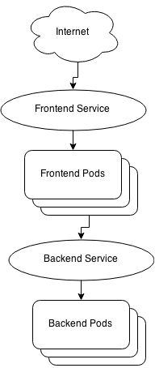

<!-- END MUNGE: UNVERSIONED_WARNING -->
环境向导示例
=========================
这个示例展示了pod,replication controller 和 service是如何运行的。示例给出了两种pod:前端pod和后端pod，在这两种pod的前面都有service与之连接。访问前端pod将返回他自己的环境变量信息，以及该pod通过service可以访问的后端pod。这个示例主要目的是说明在k8s集群里运行的容器时，可利用的环境变量元数据。k8s环境变量文档在 [这里](../../../docs/user-guide/container-environment.md)。



前提条件
-------------
这个示例假设你已经安装了可运行的k8s集群，并且安装了kubectl命令行工具且已经添加到了环境变量。安装k8s环境请阅读[getting
started](../../../docs/getting-started-guides/)文档。

可选择：构建自己的容器
-----------------------------------
容器的代码在这里
[containers/](containers/)。

开始运行
----------------------

    kubectl create -f ./backend-rc.yaml
    kubectl create -f ./backend-srv.yaml
    kubectl create -f ./show-rc.yaml
    kubectl create -f ./show-srv.yaml

查询service
-----------------
用 `kubectl describe service show-srv` 来确认你的service 的public ip。

> 注意：如果你的平台不支持外网负载均衡，你需要在内网开一个合适的端口，并且直接连内网ip，用以上的命令来输出给前端的service。

运行  `curl <public ip>:80` 来查询service。 你应该得到返回信息:

```
Pod Name: show-rc-xxu6i
Pod Namespace: default
USER_VAR: important information

Kubernetes environment variables
BACKEND_SRV_SERVICE_HOST = 10.147.252.185
BACKEND_SRV_SERVICE_PORT = 5000
KUBERNETES_RO_SERVICE_HOST = 10.147.240.1
KUBERNETES_RO_SERVICE_PORT = 80
KUBERNETES_SERVICE_HOST = 10.147.240.2
KUBERNETES_SERVICE_PORT = 443
KUBE_DNS_SERVICE_HOST = 10.147.240.10
KUBE_DNS_SERVICE_PORT = 53

Found backend ip: 10.147.252.185 port: 5000
Response from backend
Backend Container
Backend Pod Name: backend-rc-6qiya
Backend Namespace: default
```

首先，打印前端pod的信息，其name和
[namespace](../../../docs/design/namespaces.md)是从
[Downward API](../../../docs/user-guide/downward-api.md)检索出来的. 其次, `USER_VAR` 是我们定义在pod里的环境变量名字，然后，扫描动态的k8s环境变量并且打印，这些都是用来找出名字是`backend-srv`的后端的service。最后前端的pod向后端service请求并打印返回的信息。然后后端的pod返回他的pod的name和namespace。

尝试多次运行 `curl` 命令, 并且注意变化。例如: `watch -n 1 curl -s <ip>` 首先，前端的Service每次将你的请求分配到不同的前端pod，前端的pod通过后端的service与后端的pod连接，因此，每个的后端pod都可以处理各个请求。

清除工作
-------
    kubectl delete rc,service -l type=show-type
    kubectl delete rc,service -l type=backend-type


<!-- BEGIN MUNGE: GENERATED_ANALYTICS -->
[]()
<!-- END MUNGE: GENERATED_ANALYTICS -->
